<!--## Hi there 👋

**GayathriKalluri/GayathriKalluri** is a ✨ _special_ ✨ repository because its `README.md` (this file) appears on your GitHub profile.

Here are some ideas to get you started:

- 🔭 I’m currently working on ...
- 🌱 I’m currently learning ...
- 👯 I’m looking to collaborate on ...
- 🤔 I’m looking for help with ...
- 💬 Ask me about ...
- 📫 How to reach me: ...
- 😄 Pronouns: ...
- ⚡ Fun fact: ...
-->
# 👋 Hi, I'm Gayathri Kalluri

### Software Engineer | Microsoft Dynamics 365 F&O | Enterprise Technology | AI/ML Enthusiast | Java | C++ | DSA

I'm a **D365 Technical Consultant at Cognizant**, working in the **Microsoft Business Applications / Dynamics 365 Finance & Operations** ecosystem.

I enjoy building solutions at the intersection of **software engineering, artificial intelligence, machine learning, and enterprise applications**. My academic and project experience has given me hands-on exposure to developing ML models, intelligent applications, data-driven systems, and full-stack solutions.

Currently, I'm expanding my expertise in **Microsoft Dynamics 365 F&O, X++, enterprise application development, data engineering, and AI-powered solutions**.

---

## 🚀 About Me

* 💼 **D365 Technical Consultant @ Cognizant**
* 🏢 Working with **Microsoft Dynamics 365 Finance & Operations**
* 🎓 **B. Tech in Information Technology** — Vignan's Lara Institute of Technology & Science
* 🤖 Interested in **Artificial Intelligence & Machine Learning**
* 💻 Strong foundation in **C/C++ and Python**
* ☁️ Exploring **Cloud Computing, Enterprise Applications & AI**
* 🧠 Interested in building technology that solves **real-world business problems**

---

## 💻 Tech Stack

### Programming Languages


### AI / Machine Learning


### Enterprise & Microsoft Technologies


**Dynamics 365 Finance & Operations:**
`X++` · `Tables` · `Forms` · `Queries` · `Views` · `RDP` · `Security Privileges` · `BYOD` · `SysOperation Framework` · `RunBase Framework`

### Web & Backend


### Cloud & Tools


---

# 🧠 Featured Projects

## 🏠 RealityAI — Smart Real Estate Insight Platform

An AI-powered real estate analytics platform designed to provide **property price predictions and regional forecasting**.

**Key highlights:**

* Built machine learning pipelines for real-estate price prediction
* Improved model **R² from 0.28 to 0.55**
* Implemented **Lasso Regression** for the final prediction model
* Used **Prophet** for time-series forecasting
* Developed backend APIs using **FastAPI**
* Integrated the prediction system with a web-based frontend

**Tech:** `Python` `Scikit-learn` `Pandas` `FastAPI` `React` `Prophet` `Machine Learning`

---

## 🌾 AI-Powered Farmer Assistant

A web-based intelligent assistant designed to help farmers make better decisions using **machine learning and data-driven insights**.

**Tech:** `React` `Python` `Machine Learning` `Data Analysis`

---

## 🕸️ Intelligent Web Content Extraction Framework

An intelligent web-content extraction framework focused on transforming unstructured web information into structured data.

**Key highlights:**

* LLM-powered content extraction pipeline
* Structured extraction across multiple data formats
* Designed to improve retrieval efficiency
* Combines web scraping with intelligent information processing

**Tech:** `Python` `LLMs` `Web Scraping` `Data Processing`

---

## 🤟 Sign Language Detection

A computer-vision project using **Convolutional Neural Networks (CNNs)** to recognize sign language gestures.

**Tech:** `Python` `TensorFlow` `Keras` `CNN` `Computer Vision`

---

## 😴 Driver Drowsiness Detection

An AI-based computer-vision project focused on detecting driver fatigue and drowsiness.

**Tech:** `Python` `Machine Learning` `Computer Vision`

---

## 🧠 Mental Fitness Tracker

A machine-learning project focused on analyzing mental-fitness-related patterns and providing data-driven insights.

**Tech:** `Python` `Machine Learning` `Pandas` `Scikit-learn`

---

# 🏢 Professional Experience

### Cognizant Technology Solutions

**D365 Technical Consultant**

Working within the **Microsoft Business Applications** ecosystem with exposure to:

* Microsoft Dynamics 365 Finance & Operations
* X++ development
* Data modeling
* Tables, Forms, Queries and Views
* RDP Queries
* Security & Privileges
* BYOD
* SysOperation Framework
* RunBase Framework
* SQL Server Management Studio
* Enterprise application development

My current focus is understanding how **large-scale enterprise systems translate complex business requirements into scalable software solutions**.

---

# 📜 Certifications & Learning

🏆 **Microsoft Certifications**
* Microsoft Certified: Dynamics 365: Finance and Operations Apps Developer Associate
    * Exam: MB-500 — Microsoft Dynamics 365: Finance and Operations Apps Developer
    * Focus areas: X++ Development, Dynamics 365 F&O Development, Application Architecture, Data Management, Integration, Security & Performance

🤖 **AI, Cloud & Software Development**
* 🏅 IBM Edunet SkillsBuild — AICTE Virtual Internship
* 🏅 IBM NoSQL — edX
* 🏅 PCAP — Python Programming
* ☁️ AWS Academy — Cloud Foundations
* 🌐 Cisco CCNAv7
* 💻 NIIT Training
* ☕ Wipro TalentNext — Java Full Stack

### NPTEL

| Course                  | Score |
| ----------------------- | ----: |
| Python                  |   81% |
| Artificial Intelligence |   72% |
| Java                    |   67% |
| Machine Learning        |   56% |

---

# 🎓 Education

### Vignan's Lara Institute of Technology & Science

**B.Tech — Information Technology**

**2021 – 2025**
**GPA: 8.80 / 10**

---

# 🎯 Areas I'm Interested In

```text
Artificial Intelligence
Machine Learning
Generative AI
Enterprise Applications
Microsoft Dynamics 365
Cloud Computing
Data Engineering
Backend Development
Software Engineering
FinTech Technology
AI-powered Business Solutions
```

---

# 📈 My Engineering Journey

```text
B.Tech in Information Technology
            ↓
Python + C/C++ + Machine Learning
            ↓
AI/ML & Data-driven Projects
            ↓
Full-Stack & Backend Development
            ↓
Cognizant — Enterprise Technology
            ↓
Microsoft Dynamics 365 F&O
            ↓
AI + Enterprise Technology
            ↓
Building scalable real-world solutions 🚀
```

---

# 💡 What I Bring

### 🧩 Problem Solving

I enjoy breaking complex problems into smaller, practical engineering solutions.

### 🤖 AI Mindset

I have a strong interest in applying machine learning and AI to real-world problems rather than treating AI as only an academic subject.

### 🏢 Enterprise Perspective

My experience with Dynamics 365 F&O is helping me understand how software operates at an enterprise scale and how technology supports actual business processes.

### 📚 Continuous Learning

I'm continuously strengthening my knowledge across **AI, software engineering, cloud technologies, and enterprise applications**.

---

## 📊 GitHub Statistics

<p align="center">
  
  
</p>

---
## 🐍 My GitHub Contribution Graph

<p align="center">
  
</p>

---

# 🤝 Let's Connect

I'm interested in connecting with people working in:

**AI • Machine Learning • Software Engineering • Enterprise Technology • Cloud • FinTech • Microsoft Dynamics**

If you're building something interesting or working on challenging technology problems, I'd love to connect and learn from it.

<p align="center">
  <b>💻 Build. Learn. Solve. Repeat. 🚀</b>
</p>
